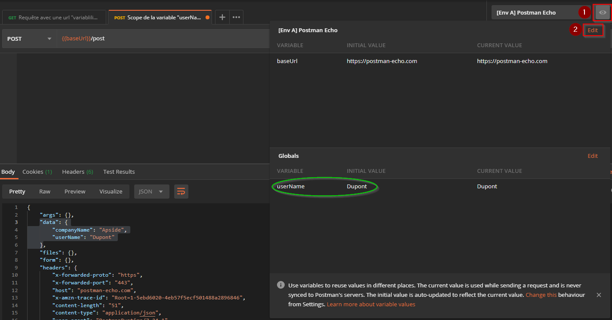

# Variables et environnements

Dans postman, les variables se comportent comme dans la majorité des langages de programmation : elles doivent être définies, sont référencées par un symbôle (leur nom) et sont utilisées pour stocker une valeur. Dans le cas de Postman, les variables seront toujours stockées sous forme de string qu'il faudra éventuellement parser si besoin. L'utilisation des variables minimise fortement le risque d'erreur, permet un travail plus efficace notamment dans le cadre de déploiement sur plusieurs environnements et autorise également la création de requêtes dynamiques en fonction du besoin (scénarios particuliers, tests automatisés, authentification, etc).

Dans Postman, on accède à la valeur d'une variable en tapant le nom d'une variable, entouré de doubles accolades : `{{maVariable}}`. On peut utiliser cette notation dans les URLs, les paramètres, les headers, le'onglet d'authentification (onglet 'Authorization'), les corps (body) des requêtes, les headers pré-enregistrés ("presets headers") ainsi que dans les scripts de pré-requête et les tests. Il existe aussi des variables dites 'dynamiques' proposées par Postman afin de générer aléatoirement des données de test. Elles sont accessibles en ajoutant le préfixe `$` comme par exemple `{{$randomFirstName}}`. La liste complète est sur la page suivante : https://learning.postman.com/docs/postman/variables-and-environments/variables-list/

---

## Qu'est-ce qu'un environnement ?

Un environnement dans Postman est un ensemble de variables permettant de faire tourner des requêtes avec des jeux de données différents. L'utilisation typique de différents environnements est l'emploi d'une seule et même collection pour différents environnements tels que "Développement", "Intégration", "Recette", "Production" par exemple.

## Création d'une variable d'environnement

### Exemple avec l'url de l'API

L'exemple parfait pour illustrer la création d'une variable ainsi que l'utilisation des environnements est la création de la variable stockant la valeur de l'url de l'API. Dans notre exemple, après avoir créé un nouveau dossier "Chapitre 2...", nous allons créer la même requête que dans le dossier "Chapitre 1" en remplaçant dans la barre d'adresse `https://postman-echo.com` par une référence à une variable `{{baseUrl}}`. Si tout s'est bien passé, Postman doit afficher la variable en rouge car il ne parvient pas à trouver la définition de la variable `baseUrl`. D'ailleurs si on survole le nom de la variable, un tooltip doit apparaître avec un message d'erreur.


Il faut donc créer cette variable et nous allons pour cela commencer par créer un environnement en cliquant sur le bouton `New` en haut à gauche de la fenêtre puis sur `Environment`.


Il faudra ensuite donner un nom à cet environnement, lui ajouter la variable souhaitée dans la colonne `initial value` puis cliquer sur le bouton `Add` :


Si la variable apparaît toujours en rouge après l'ajout de l'environnement, c'est que ce dernier n'est pas sélectionné. Il faut pour cela cliquer sur le menu déroulant en haut à droite de la fenêtre et sélectionner l'environnement récemment créé.
Après cela, la variable doit apparaître en orange et au survol afficher la valeur qui lui a été affectée. La requête doit être fonctionnelle et renvoyer 


On peut noter dans le tolltip ouvert par Postman au survol de la variable la présence d'un `E` vert.

Ceci indique le **scope** de la variable ou autrement dit sa **portée**.

## **Scope** d'une variable dans Postman

Plusieurs scopes sont disponibles pour les variables dans Postman. Si une variable avec le même nom est déclarée dans deux scopes différents, alors la valeur contenue dans la variable du scope le plus "petit" sera utilisée.


Pour illustrer ce propos, créons une nouvelle requête (POST cette fois) dans le dossier "Chapitre 2" de notre collection et "variabilisons" un attribut du body de la requête.


Déclarons maintenant une variable "globale" grâce à l'outil de gestion rapide des environnements en cliquant sur le symbôle de l'oeil en haut à droite de la fenêtre puis sur le bouton `Edit` en face de la section `Globals`.


Ajoutons la variable globale `userName` et affectons lui la valeur "Dupont" (pour un maximum d'originalité) puis enregistrons. Si nous envoyons cette requête POST, le corps de la réponse contiendra entre autre l'objet suivant :

```json
"data": {
        "companyName": "Apside",
        "userName": "Dupont"
}
```

Par le même biais (la gestion rapide des environnements) éditons cette fois l'environnement créé au début de ce chapitre. 
>*Remarquons au passage, entouré en vert, l'affichage de la variable à portée "globale" utilisée auparavant.*



Affectez à une nouvelle variable `userName ` de l'environnement `[Env A] Postman Echo` la valeur "Durand". Lancez la requête et observez la valeur de la variable utilisée.


>*Note : si vous souhaitez ne pas déclarer la variable dans un scope ou dans l'autre, il suffit de la décocher dans la liste de l'environnement en question*

S'il y a plusieurs scopes disponibles pour déclarer des variables, il y a donc autant d'utilisations spéciales et de contre-inidcations pour leur utilisation :

- Les **variables globales** permettent le partage de données au niveau... global. Leur valeur sera donc disponibles entre différentes collections, requêtes, scripts et environnement.
  - La portée globale de ces variables crée une certaine confusion et peut rapidement mener à de potentielles erreurs, surtout lorsqu'elles sont remplacées (ce qui est souvent le cas) par des variables au scope plus restreint. Ce scope "global" est donc fortement déconseillé, sauf en de rares cas ou de manière éphémère, dans le cas d'un prototypage rapide ou un test succint
  
- Les **variables de collection** sont disponibles pour toutes les requêtes d'une collection et sont indépendantes de l'environnement. Leurs valeurs ne peuvent pas être modifiées dans les scripts ce qui les rend contraignantes et finalement peu utilisée car souvent supplantées par les variables d'environnement.
  - À utiliser seulement dans le cas où l'API ne possède qu'un environnement atteignable
  
- Les **variables d'environnement** permettent d'adapter les requêtes en fonction des environnements sur lesquels elles doivent pointer. On ne peut activer qu'un seul environnement à la fois. Ce sont les variables les plus couramment utilisées avec les variables locales.

- Les **variables locales** sont des variables temporaires et leur valeur n'est accessible que durant le laps de temps compris entre le déclenchement du script de pré-requête et celui du script de test.

- Les **Data variables** sont disponibles uniquement dans le cadre de l'automatisation d'une collection via l'outil Newman ou le Runner Postman. Elles sont disponibles durant toute l'itération et proviennent de fichiers externes au format CSV ou JSON.

>*Note : il existe un dernier type de variable : les **variables de session** qui ne font pas partie d'un scope à proprement parler mais qui permette de conserver des valeurs en local, sans qu'elles ne soient synchronisées sur un quelconque serveur Postman. C'est très utile notamment pour des identifiants d'authentification personnels ou des clés API  payantes. Nous en parlerons plus en détail dans le chapitre sur le travail collaboratif*


Comme indiqué sur le schéma ci-dessus, Postman expose certaines API telles que `pm.variables.set(...)` et `pm.variables.get(...)` afin d'accéder au contenu des variables depuis les scripts. Nous verrons cela dans le [prochain chapitre consacré aux scripts et aux tests](03-basics-scripts_et_tests.md).