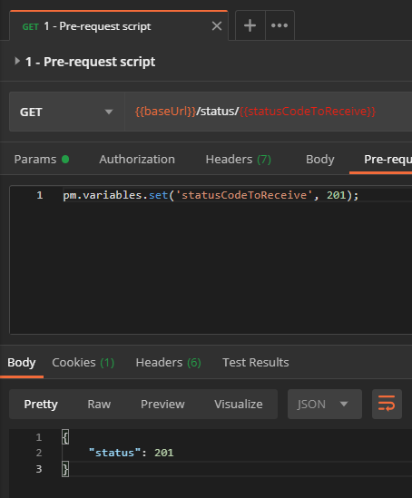

# **Scripts et tests (basique)**

Les scripts dans Postman sont des programmes écrits en Javascript permettant d'effectuer des requêtes dynamiques, d'écrire des scénarios de test, faire transiter de la donnée d'une requête à l'autre par le biais notamment des variables vues dans le chapitre précédent.

---

## **Scripts**

Deux types de scripts peuvent être exécutés, chacun à un moment distinct :

1. Avant l'envoi de la requête, il s'agit de l'onglet "Pre-request Script"
2. Après la réception de la réponse, il s'agit de l'onglet "Tests Script"


### **Exemple de script de pré-requête**

Nous allons faire appel au endpoint GET `https://postman-echo.com/status/201` en déclarant cette fois une variable "locale" (donc disponible temporairement et exclusivement dans cette requête) depuis le script de pré-requête et ce grâce au code suivant :

```javascript
pm.variables.set('statusCodeToReceive', 201);
```



Si on effectue la requête, on peut s'apercevoir que la variable `statusCodeToReceive` a bien été remplacée par la valeur `201`. Nous avons donc réussi à assigner cette valeur à notre variable et ce dans le scope 'local', c'est à dire dans le scope le plus restreint proposé par Postman.

### **Scripts de test intégrés à la requête**

Dans cet exemple, nous allons assigner la valeur `401` à la variable `statusCodeToReceive` par le biais d'une **variable d'environnement**, toujours déclarée dans le script de pré-requête grâce au code suivant :

```javascript
pm.environment.set('statusCodeToReceive', 401);
```

Cette valeur pourra alors être réutilisée par la suite puisque toutes les requêtes ont accès aux variables de l'environnement sélectionné et on peut s'en rendre compte grâce au bouton de "visualisation rapide" des environnements symbôlisé par l'oeil en haut à droite de la fenêtre Postman. Cependant, il est dans les bonnes pratiques de supprimer une variable qui n'est plus utilisée grâce à la ligne `pm.environment.unset('variableName');`.

Dans le script de Tests, nous allons effectuer le test le plus simple qui soit. Nous allons nous assurer que le statut HTTP de la réponse est bien celui que nous avons demandé lors de la requête grâce au code suivant :

```javascript
pm.test("Status should be '401'", function () {
    pm.response.to.have.status(401);
});
```

Après avoir envoyé la requête grâce au bouton `Send`, nous pouvons accéder aux résultats des tests grâce à l'onglet `Test Results`.


Quelques exemples de tests sont rajoutés dans cette requête, n'hésitez pas à la lancer sur Postman et examiner les résultats en cas d'échec. Il existe différentes syntaxes pour écrire les tests, nous en verrons plusieurs dans la suite de cette introduction.

> Note : des snippets de code sont disponibles dans un panneau à droite de la fenêtre d'écriture des scripts pour faciliter et accélérer la création des tests "classiques". Pour insérer un snippet, il suffit de cliquer dessus.

Nous pouvons améliorer l'exemple ci-dessus en utilisant la variable déclarée durant le script de pré-requête grâce à la ligne suivante `pm.environment.get('variableName')`.


>Notez l'ajout d'un `console.log(pm.response)` qui a été ajouté afin de démontrer l'utilisation de la console Postman. Elle est accessible via un bouton situé en bas à gauche de la fenêtre et s'ouvre dans une fenêtre à part. Elle est très utile pour débugger ou simplement [comprendre les fonctionnalités offertes par Postman](https://learning.postman.com/docs/postman/scripts/postman-sandbox-api-reference/).


### **Scripts de test intégrés à la collection**

D'autres scripts que ceux déclenché lors d'une requête sont disponibles au niveau de la collection et au niveau de chaque sous-dossier. Ces scripts sont éxécutés avant ou après **chaque requête** contenue dans la collection ou le sous-dossier, suivant l'emplacement du script. 


Ceci permet donc de mutualiser les scripts et réduit considérablement l'effort de maintenance des scripts d'une collection. Nous allons illustrer le fonctionnement grâce à la console Postman dont nous avons parlé auparavant.
Créons un sous-dossier "4 - Mutualisation des scripts" et créons une unique requête dans ce sous-dossier. Cette requête n'aura pas de test mais lorsqu'on la lancera, les scripts du dossier qui la contient, eux, se lanceront. Pour cela, il nous faut éditer le dossier concerné.


Une fenêtre de dialogue s'ouvre avec quatre onglets, dont deux qui nous sont familiers : `Pre-request Scripts` et `Tests`.
Dans le premier, nous allons initialiser une variable d'environnement `folderName` et dans le second, nous allons tester que la réponse ait bien le statut 200 puis supprimer la variable de l'environnement car elle ne sera utilisée nulle part ailleurs.

```javascript
// ---------------- Onglet "Pre-request Script" ----------------
const folderName = '4 - Mutualisation des scripts';

pm.environment.set('folderName', folderName);

console.log(`Nous avons initialisé la variable 'folderName' dans le script de pré-requête du dossier "${folderName}"`);

// --------------- Onglet "Tests" ---------------
pm.test(`Response status should be 200`, () => {
    pm.response.to.have.status(200);
});

pm.environment.unset('folderName');
```

Si on envoie la première requête présente dans ce dossier, on s'aperçoit que, bien que les scripts de cette requête soient vides, les scripts du dossier ont bien été exécutés.


Cependant, outre la consultation de la console Postman, on ne s'assure à aucun moment que la valeur envoyée lors de la requête soit correct. Pour cela nous allons créer une seconde requête mais cette fois-ci en testant la valeur reçu dans le body de la réponse de l'API grâce au code suivant :

```javascript
// ------------- Onglet "Tests" -------------

const folderName = pm.variables.get('folderName'); // Récupère la valeur de la variable 'folderName' dans le scope le plus restreint (ici environment)

const parsedBody = pm.response.json(); // Récupère le body de la réponse au format JSON

pm.test(`Response should have the correct folder name: "${folderName}"`, function () {
    pm.expect(parsedBody.data.folder).to.eql(folderName);
});

pm.environment.unset('folderName'); // Supprime la variable d'environnement 'folderName' car ceci est le dernier test à l'utiliser
```

Si on envoie la requête, on s'aperçoit qu'un test a bien été ajouté au test du dossier.


