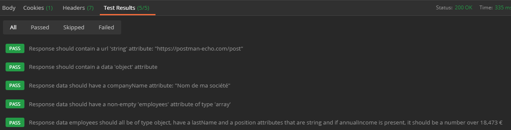

# **Scripts et tests (intermédiaire)**

Afin de valider une réponse, on peut donc -comme expliqué dans le chapitre précédent- parser le corps de la réponse de l'API et, à l'aide d'assertions, tester les attributs qui nous intéressent, leur type, leur valeur, etc. Cependant l'écriture peut rapidement s'avérer fastidieuse dans le cas d'objets complexes ou de tableaux d'objets complexes contenant par exemple eux même des tableaux d'objets complexes.

Une alternative est possible grâce à la validation par [JSON Schema](http://json-schema.org/understanding-json-schema/).

Nous allons valider ici des deux façons la réponse à la requête sur l'url `https://postman-echo.com/post` avec le body suivant :

```json
{
  "companyName": "{{companyName}}",
  "employees": [
    {
      "lastName": "{{userName}}",
      "position": "Web developer",
      "annualIncome": 27000
    },
    {
      "lastName": "Dupont",
      "position": "CTO",
      "annualIncome": 50000
    },
    {
      "lastName": "Martin",
      "position": "Janitor",
      "annualIncome": 19000
    },
    {
      "lastName": "Morand",
      "position": "Scrum master"
    }
  ]
}
```

La réponse de l'api est la suivante :

```json
{
  "args": {},
  "data": {
    "companyName": "Nom de ma société",
    "employees": [
      {
        "lastName": "Durand",
        "position": "Web developer",
        "annualIncome": 27000
      },
      {
        "lastName": "Dupont",
        "position": "CTO",
        "annualIncome": 50000
      },
      {
        "lastName": "Martin",
        "position": "Janitor",
        "annualIncome": 19000
      },
      {
        "lastName": "Morand",
        "position": "Scrum master"
      }
    ]
  },
  "files": {},
  "form": {},
  "headers": {},
  "url": "https://postman-echo.com/post"
}
```

## **Validation via Postman `pm.expect`**

---

Les scripts de tests peuvent être écrits de façon très lisible et ce grâce à une syntaxe basée sur la librairie [ChaiJS](https://www.chaijs.com/api/bdd/) et inspirée de la méthode [Behaviour Driven Development](https://en.wikipedia.org/wiki/Behavior-driven_development).

Pour l'écriture de test plus compliqué, comme nous allons voir plus loin dans cette introduction, la consultation de la documentation de cette librairie n'est pas obligatoire mais peut s'avérer instructive.

Si nous devions tester très basiquement la réponse à notre requête par le biais de l'API postman `pm.expect`, le script de test serait de cet acabit (dépend bien-sûr de ce que l'on souhaite tester) :

```javascript
const companyName = pm.variables.get("companyName");
const userName = pm.variables.get("userName");
const baseUrl = pm.variables.get("baseUrl");

const parsedBody = pm.response.json();

// Teste le type et la valeur de l'attribut 'url' de la réponse
pm.test(
  `Response should contain a url 'string' attribute: "${baseUrl}/post"`, function () {
    pm.expect(parsedBody.url).to.be.a("string").that.is.eql(`${baseUrl}/post`);
  }
);

pm.test(`Response should contain a data 'object' attribute`, function () {
  pm.expect(parsedBody.data).to.be.an("object").that.is.not.empty;
});

pm.test(
  `Response data should have a companyName attribute: "${companyName}"`, function () {
    pm.expect(parsedBody.data.companyName).to.eql(companyName);
  }
);

pm.test(
  `Response data should have a non-empty 'employees' attribute of type 'array'`, function () {
    pm.expect(parsedBody.data.employees).to.be.an("array").that.is.not.empty;
  }
);

pm.test(
  `Response data employees should all be of type object, have a lastName and a position attributes that are string and if annualIncome is present, it should be a number over 18,473 €`,
  function () {
    const employees = parsedBody.data.employees;
    console.log("Employees list: \n", employees);

    for (employee of employees) {
      pm.expect(employee).to.be.an("object");
      pm.expect(employee).to.have.property("lastName");
      pm.expect(employee).to.have.property("position");
      pm.expect(employee.lastName).to.be.a("string");
      pm.expect(employee.position).to.be.a("string");
      if (employee.annualIncome) {
        pm.expect(employee.annualIncome).to.be.a("number").above(18473);
      }
    }
  }
);
```

L'un des avantages de cette méthode, bien que longue à écrire et peu réutilisable, est la lisibilité des tests et de leurs résultats, comme en témoigne la capture d'écran ci-dessous.



## **Validation par [JSON Schema](http://json-schema.org/understanding-json-schema/)**

### **Le JSON Schema dans Postman**

---

Un JSON Schema est la représentation (en JSON) de la structure d'une donnée JSON. Autrement dit, déclarer un JSON Schema c'est décrire un objet JavaScript attendu, aussi complexe qu'il puisse être. Dans Postman, on peut utiliser un JSON Schema dans un script de test grâce à la ligne suivante :

```javascript
pm.test(
  `Response body should be validated by schema '${schema.title}'`,
  function () {
    pm.response.to.have.jsonSchema(schema);
  }
);
```

Des outils sont bien entendu disponible sur Internet afin de convertir un JSON en JSON Schema (<https://www.liquid-technologies.com/online-json-to-schema-converter>, <https://www.jsonschema.net/home>) et simplifient donc leur création, même s'il faut toujours bien vérifier le JSON généré par l'outil et souvent l'adapter à notre situation (modifier le tableau `required` par exemple ou ajouter un attribut `title` explicite).

L'avantage de ce processus de validation est que nous pouvons décrire et définir le type de chaque attributs, tableaux ou objets contenus dans la réponse de l'API, déclarer les attributs optionnels ou obligatoires, mutualiser les définitions des schémas, leur ajouter des titres et des descriptions lisibles par les autre utilisateurs de la collections...

### **Validation par JSON Schema**

---

En reprenant l'exemple ci-avant et en considérant comme `required` uniquement les attributs `url`, `headers` et `data` de la réponse API, notre script de Test sera le suivant :

```javascript
const baseUrl = pm.variables.get("baseUrl");

const postCompanySchema = {
  title: "Post Company with Employees Schema",
  type: "object",
  properties: {
    args: {
      type: "object",
    },
    data: {
      type: "object",
      properties: {
        companyName: {
          type: "string",
        },
        employees: {
          type: "array",
          items: {
            type: "object",
            properties: {
              lastName: {
                type: "string",
              },
              position: {
                type: "string",
              },
              annualIncome: {
                type: "number",
                minimum: 18473,
              },
            },
            additionalProperties: false,
            required: ["lastName", "position"],
          },
        },
      },
      required: ["companyName", "employees"],
    },
    files: {
      type: "object",
    },
    form: {
      type: "object",
    },
    headers: {
      type: "object",
    },
    url: {
      type: "string",
      enum: [`${baseUrl}/post`],
    },
  },
  required: ["data", "headers", "url"],
};

pm.test(
  `Response body should be validated by schema '${postCompanySchema.title}'`, function () {
    pm.response.to.have.jsonSchema(postCompanySchema);
  }
);
```

Cela peut paraître plus long en écriture mais la majorité du schéma vient de la conversion de la réponse de l'API vers un JSON Schema grâce à un outil en ligne.

On peut noter la présence d'une seule ligne de test pour valider toute la réponse de l'API postman-echo.

L'inconvénient de cette méthode est principalement l'opacité des tests. En effet, on ne peut deviner la nature des tests sans consulter le schéma déclaré dans le script, comme l'illustre la capture d'écran du panel de résultat de tests.


Cependant, nous allons voir que l'on peut aisément passer ce JSON Schema en variable d'environnement afin de le réutiliser dans les tests qui le nécessitent.

### **Réutilisation de JSON Schema**

---

Dans le chapitre 3, nous avons pu mutualiser les scripts grâce à l'utilisation des scripts déclarés au niveau du dossier (et non plus au niveau des requêtes). Nous allons réutiliser cette méthode afin de déclarer une variable d'environnement contenant le JSON Schema précédemment déclaré.

Accédons donc au script de pré-requête **du dossier** comme dans le chapitre trois.


Le script de pré-requête se jouera avant **chaque requête** présente dans le dossier. Si nous l'avions mis au niveau de la colleciotn (par le même biais `...`), il s'éxécuterait avant chaque requête de la collection complète (cf. diagramme du chapitre 3 concernant l'ordre d'éxécution des scripts).

Dans ce script, nous déclarons le schéma et assignons sa valeur _"stringifiée"_ à nouvelle variable d'environnement :

```javascript
const baseUrl = pm.variables.get("baseUrl");

// Déclaration du schéma "postCompanySchema"
const postCompanySchema = {
  title: "Post Company with Employees Schema",
  type: "object",
  properties: {
    args: {
      type: "object",
    },
    data: {
      type: "object",
      properties: {
        companyName: {
          type: "string",
        },
        employees: {
          type: "array",
          items: {
            type: "object",
            properties: {
              lastName: {
                type: "string",
              },
              position: {
                type: "string",
              },
              annualIncome: {
                type: "number",
                minimum: 18473,
              },
            },
            additionalProperties: false,
            required: ["lastName", "position"],
          },
        },
      },
      required: ["companyName", "employees"],
    },
    files: {
      type: "object",
    },
    form: {
      type: "object",
    },
    headers: {
      type: "object",
    },
    url: {
      type: "string",
      enum: [`${baseUrl}/post`],
    },
  },
  required: ["data", "headers", "url"],
};

// Assignation du schéma "stringifié" à la variable d'environnement "postCompanySchema"
pm.environment.set("postCompanySchema", JSON.stringify(postCompanySchema));
```

Dans le script de test de la requêt de l'exemple 3, nous pouvons simplement récupérer le schéma depuis l'environnement, le parser et écrire le test comme dans l'exemple précédent :

```javascript
const postCompanySchema = JSON.parse(pm.environment.get("postCompanySchema")); // il faut parser le contenu de la variable car on ne peut pas stocker de valeur autrement qu'en string

pm.test(`Response body should be validated by schema '${postCompanySchema.title}'`, function () {
    pm.response.to.have.jsonSchema(postCompanySchema);
  }
);

pm.environment.unset("postCompanySchema");
```

## **À venir**

---

Après avoir vu comment potentiellement réutiliser un schéma en le stockant en variable d'environnement, nous allons voir comment mutualiser du code Javascript et réutiliser des blocs de code à travers toute la collection.
